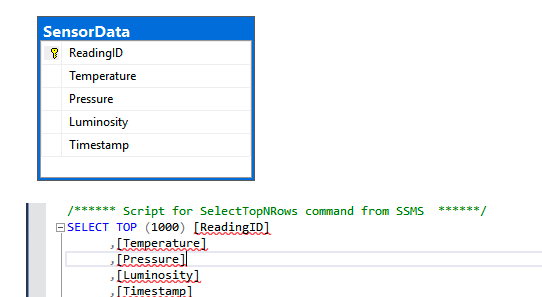
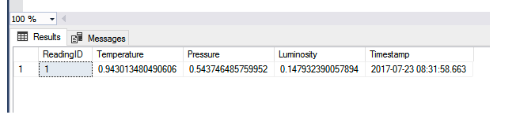

# Database Monitoring Windows Service
Database Monitoring Windows Service

This project is a monitoring service which can monitor a SQL Server table for new records. As soon
as a new record is found the service logs the new record to a file called C:\alerts.txt.

---
Implemented as a Windows Service which checks the database for new records every x number of seconds.(x can be specified in the app.config file.)

---

## Config file
```xml
<?xml version="1.0" encoding="utf-8" ?>
<configuration>
    <startup> 
        <supportedRuntime version="v4.0" sku=".NETFramework,Version=v4.5.2" />
    </startup>

  <connectionStrings>
    <add name="dbConnectionString"
        connectionString="YOUR_CONNECTION_STRING"
        providerName="System.Data.SqlClient" />
  </connectionStrings>
  <appSettings>
    <add key="PollingInterval" value="6000"/>
   </appSettings>
</configuration>

```
---
## Database
* The database used to test the service was SQL Server database. 
* Table used was named SensorData (used for an IoT solution)


```sql
SET ANSI_NULLS ON
GO
SET QUOTED_IDENTIFIER ON
GO
CREATE TABLE [dbo].[SensorData](
[ReadingID] [bigint] IDENTITY(1,1) NOT NULL,
[Temperature] [float] NOT NULL,
[Pressure] [float] NOT NULL,
[Luminosity] [float] NOT NULL,
[Timestamp] [datetime] NOT NULL,
CONSTRAINT [PK_SensorData] PRIMARY KEY CLUSTERED
(
[ReadingID] ASC
)WITH (PAD_INDEX = OFF, STATISTICS_NORECOMPUTE = OFF, IGNORE_DUP_KEY = OFF,
ALLOW_ROW_LOCKS = ON, ALLOW_PAGE_LOCKS = ON) ON [PRIMARY]
) ON [PRIMARY]
```
* Test data 


```sql
INSERT INTO [dbo].[SensorData] ([Temperature], [Pressure], [Luminosity], [Timestamp])
VALUES (RAND(),RAND(),RAND(),GETDATE())
```

## Installation
The project also includes a Service Installer.

## Implementation details
The monitoring implementation is very simple. A timer is used to execute a database query every so often (every minute for example). 
### Monitoring code 
```c#
  protected override void OnStart(string[] args)
        {
            currentRowCount = getRowCount();
            //setup timer for polling
            SetupTimer();
        }

        private void SetupTimer()
        {
            // Set up a timer to trigger every minute.  
            System.Timers.Timer timer = new System.Timers.Timer();
            timer.Interval = Int32.Parse(ConfigurationManager.AppSettings["PollingInterval"]);
            timer.Elapsed += new System.Timers.ElapsedEventHandler(this.OnTimer);
            timer.Start();
        }
        public void OnTimer(object sender, System.Timers.ElapsedEventArgs args)
        {
            //   monitoring activities here.  
            int rowCount = getRowCount();
            if (currentRowCount > rowCount )
            {
                LogAlert();();
            }
           
        }
 ```
 ### Log Alert
 Log Alert gets the data and appends it to the alerts file
 ```c#
  static void LogAlert()
        {
            string connString = "YOUR_CONNECTION_STRING";
            string stmt = "SELECT TOP(1) * FROM[SensorDataDB].[dbo].[SensorData] ORDER BY[ReadingID] DESC";

            SqlConnection sqlConnection1 = new SqlConnection(connString);
            SqlCommand cmd = new SqlCommand();
            SqlDataReader reader;

            cmd.CommandText = stmt;
            cmd.CommandType = CommandType.Text;
            cmd.Connection = sqlConnection1;

            sqlConnection1.Open();

            reader = cmd.ExecuteReader();
            // Data is accessible through the DataReader object here.
            if (reader.HasRows)
            {
                while (reader.Read())
                {
                   // Console.WriteLine(reader["Temperature"]);
                    string id = reader["ReadingID"].ToString();
                    string temp = reader["Temperature"].ToString();
                    string pressure = reader["Pressure"].ToString();
                    string luminosity = reader["[luminosity"].ToString();
                    string timeStamp = reader["Time/stamp"].ToString();
                    //System.Text.StringBuilder sb = new System.Text.StringBuilder();
                    string logline = id + "," + temp + "," + pressure + "," + luminosity + "," + timeStamp;
                    File.AppendAllText(@"c:\alerts.txt", logline + Environment.NewLine);
                    //TODO windows events, other 
                }
            }
            else
            {
                Console.WriteLine("No rows found.");
            }
            reader.Close();
            sqlConnection1.Close();
        }
 ```
 
